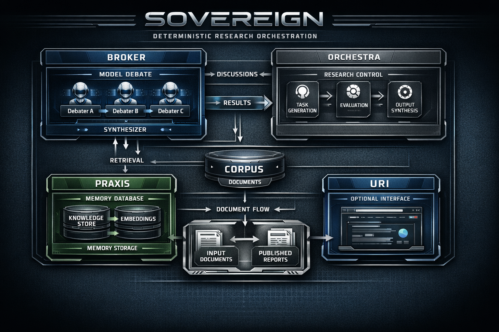

# SOVEREIGN
Deterministic Multi-Model Research Orchestration Engine

SOVEREIGN is a deterministic multi-model research pipeline designed to orchestrate structured debate between local language models, synthesize conclusions, and persist knowledge into a memory system.

The system is designed for offline research environments emphasizing reproducibility, explicit orchestration, and minimal hidden state.

It runs entirely on local hardware and integrates with Ollama for model inference.

---

# Overview

SOVEREIGN orchestrates a complete research loop:

1. ingest documents  
2. extract research questions  
3. run adversarial multi-model debate  
4. synthesize conclusions  
5. evaluate quality gates  
6. persist knowledge to memory  
7. publish structured outputs  

The architecture prioritizes deterministic execution and transparent research artifacts.

---

# System Architecture

Core components:

Broker – multi-model debate orchestration  
Orchestra – research cycle controller  
Praxis – persistent knowledge memory  
Corpus – research input/output documents  
URI – optional web research interface

---

# Repository Structure

SOVEREIGN/

broker/ – debate broker  
orchestra/ – research cycle engine  
praxis/ – persistent knowledge memory  
corpus/ – research documents  
examples/ – interface snapshots and reference assets  
docs/ – diagrams and documentation

---

# Hardware Environment

Reference development environment:

CPU: Intel i5-13500T  
RAM: 64GB DDR4  
GPU: RTX 3070 8GB  
Storage: NVMe SSD  
OS: Windows 11  
Runtime: Python + PowerShell  
LLM Runtime: Ollama

---

# Model Configuration

Example model configuration:

Debater A: deepseek-r1:8b  
Debater B: dolphin-llama3:8b  
Debater C: qwen3:8b  
Synthesizer: dolphin3:8b  
Embeddings: nomic-embed-text

Models run locally through Ollama.

---

# Installation

Install Ollama:

https://ollama.ai

Pull models:

ollama pull deepseek-r1:8b  
ollama pull dolphin-llama3:8b  
ollama pull qwen3:8b  
ollama pull dolphin3:8b  
ollama pull nomic-embed-text  

Initialize Praxis memory:

python praxis/init_praxis.py

Ingest documents:

python praxis/ingest_corpus.py

Run research cycle:

python orchestra/cycle_runner.py

---

# Design Principles

Deterministic execution  
Offline-first architecture  
Modular orchestration  
Research traceability  
Model-agnostic infrastructure

---

# Releases

Reproducible research snapshots are attached to GitHub releases.

https://github.com/darksciencedivision-ctrl/sovereign/releases

---

# License

This repository uses a dual-license model.

Research License – non-commercial use permitted  
Commercial License – required for commercial deployment

See:

LICENSE  
LICENSE_COMMERCIAL.md

---

# Author

Dark Science Division

Independent AI systems research
